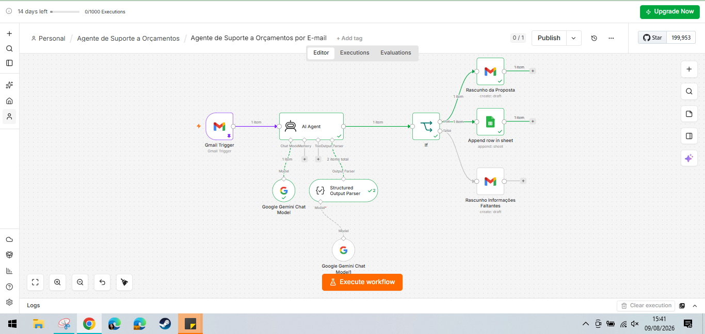
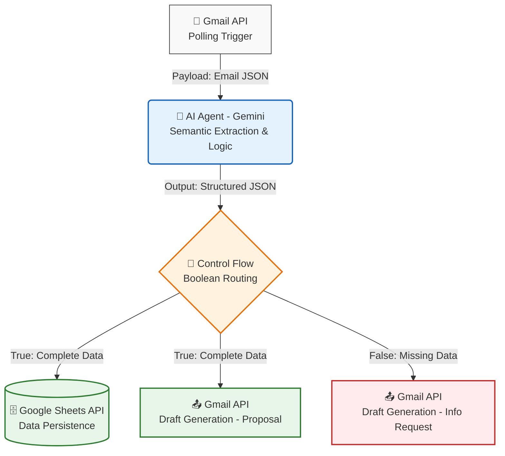

# 🤖 AI Agent para Triagem de Orçamentos (ClimaNorte)

Assistente inteligente para automação comercial e suporte a clientes desenvolvido com **n8n**, **Google Gemini**, **Google Sheets** e **Gmail**. O projeto foi estruturado para atuar na central de atendimento de empresas de serviços técnicos, automatizando a leitura de e-mails, cálculo de propostas e gestão de banco de dados. 

A empresa de referência para o caso de uso deste projeto foi a fictícia **ClimaNorte Refrigeração**, com foco no atendimento a condomínios e resorts no Litoral Norte da Bahia.

A solução permite que a equipe comercial ganhe escalabilidade, substituindo a triagem manual de e-mails incompletos por um fluxo autônomo que interage com o cliente e prepara os orçamentos em modo rascunho para aprovação final.

<table>
  <tr>
    <td></td>
  </tr>
</table>

---

# 📌 Sobre o Projeto

No setor de manutenção predial e industrial, equipes comerciais frequentemente gastam horas analisando solicitações de orçamento via e-mail que não possuem os dados mínimos para a elaboração de uma proposta. Isso gera um gargalo no tempo de resposta e falhas na padronização dos orçamentos.

Este projeto foi desenvolvido para transformar o recebimento de e-mails em um funil inteligente e estruturado, capaz de extrair dados de textos não padronizados, validar regras de negócio complexas e estruturar os resultados de forma acionável para a equipe humana.

O sistema utiliza uma arquitetura linear que combina:
* 🧠 **Inteligência Artificial Generativa:** LLM (Gemini) atuando como orçamentista para extração de variáveis e cálculo lógico (taxas de deslocamento e urgência).
* 🗂️ **Parseamento Estruturado:** Força o modelo de linguagem a responder estritamente em um schema JSON predefinido.
* 🗄️ **Banco de dados em Nuvem (Google Sheets):** Alimentação de um pipeline de vendas e histórico de solicitações em tempo real.
* 📧 **Orquestração de E-mail (Gmail):** Geração dinâmica de rascunhos anexados à "thread" (conversa) original do cliente.

---

# 🚀 Funcionalidades

## Triagem Inteligente de Dados
O Agente lê o e-mail em linguagem natural e tenta extrair 5 dados obrigatórios:
* Localização;
* CEP;
* Quantidade de máquinas;
* Tipo de serviço (Preventiva, Corretiva, Instalação);
* Data proposta para execução.

## Cálculo e Proposta (Caminho True)
Se a IA validar que todos os dados estão presentes:
* Calcula o **Dias para Atendimento** e define o nível de **Urgência** (Baixa, Média, Alta).
* Executa o cálculo de preço base, acrescido de taxas de deslocamento (por quilometragem no Litoral Norte) e fatores de acréscimo (ex: clientes do tipo "Resort").
* Salva a linha de dados limpos na planilha de controle.
* Gera um rascunho com o orçamento finalizado.

## Tratamento de Exceções (Caminho False)
Se a solicitação vier incompleta:
* O sistema identifica exatamente qual dado faltou (ex: "O cliente não enviou o CEP").
* Pula a etapa de salvar no banco de dados.
* Gera um rascunho de e-mail de resposta cordialmente solicitando as informações específicas que restaram.

---

# 🔄 Arquitetura

A solução foi desenhada sob um padrão arquitetural orientado a eventos (*Event-Driven Architecture*), utilizando o n8n como orquestrador (*middleware*) entre os serviços. O processamento segue um pipeline lógico de extração, transformação e carga, onde dados desestruturados são convertidos em esquemas rígidos (JSON) para persistência e tomada de ação.

Abaixo está o diagrama do fluxo de dados (*Data Flow Diagram*) da aplicação:

# 🛠️ Tecnologias e Ferramentas

| Categoria | Ferramenta / Serviço | Papel na Arquitetura |
| :--- | :--- | :--- |
| **Orquestração** | n8n | Integração dos nós, orquestração de gatilhos e lógica de roteamento (IF) |
| **Inteligência Artificial** | Google Gemini (PaLM) | Agente de análise de texto, cálculo de regras de negócio e formatação JSON |
| **Banco de Dados** | Google Sheets | Armazenamento estruturado e limpo dos orçamentos para futura integração com B.I. |
| **Interface de Comunicação** | Gmail | Ponto de entrada (Gatilho) e saída (Criação de Rascunhos) da automação |

---

# ⚙️ Como executar este projeto

Se você deseja replicar este assistente no seu próprio ambiente n8n, siga os passos abaixo:

### 1. Pré-requisitos
* Uma instância do [n8n](https://n8n.io/) rodando.
* Credenciais OAuth2 do Google Cloud Console para o **Gmail API** e **Google Sheets API**.
* Uma chave de API (API Key) do **Google Gemini**.

### 2. Configuração do Banco de Dados
Na pasta `/database` deste repositório, você encontrará o arquivo `.xlsx` de template. Importe este arquivo no seu Google Drive para criar a planilha exata com os cabeçalhos esperados pelo fluxo.

### 3. Regras de Negócio (Prompt)
Para entender a lógica de cálculo e adaptar os preços e localizações para a sua realidade de negócios, consulte o arquivo `system_prompt.md` localizado na pasta `/prompts`.

### 4. Importação do Workflow
1. Acesse a pasta `/workflow` e baixe o arquivo `Agente_Suporte_Orcamentos.json`.
2. Abra o seu n8n, vá em *Workflows* > *Import from File* e selecione o arquivo baixado.
3. Cadastre e vincule as suas próprias credenciais do Google e Gemini nos respectivos nós.
4. No nó "Append row in sheet", substitua a URL temporária pelo link da sua própria planilha do Google Drive.

---

# 🎯 Aplicação e Benefícios
Este projeto demonstra, na prática, como ferramentas de automação *Low-Code* integradas a LLMs modernos podem resolver dores reais de gestão de facilities, operações e manutenção.

A padronização das respostas, a eliminação do trabalho braçal de "copiar e colar" dados e a garantia de que as regras comerciais sejam seguidas com 100% de precisão geram valor imediato para qualquer setor de orçamentação e planejamento.
